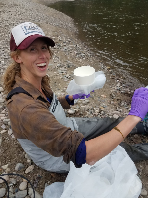

<br>
<br>

## About Me


I am currently growing my business as a consultant and environmental researcher. I live in the Pacific Northwest and grew up near the north fork of the Lewis River in SW Washington. My work is fueled by my passion for clean water and community engagement in water quality. I love growing my own food, trail running, painting, and spending time with my family, including my son. 


```{r , echo = F,out.width = '20%'}

```
