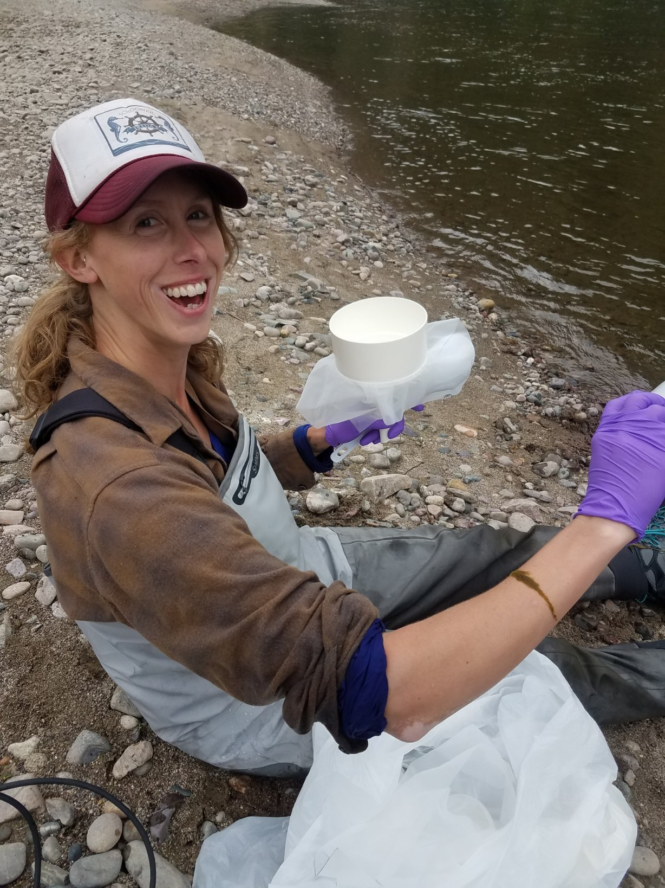

<br>
<br>

## About Me


I am a graduate researcher at the University of Montana working in the Clark Fork River with Dr. Ben Colman and will complete my MS in Systems Ecology in November 2020.


I grew up near Mt. St. Helens in SW Washington. I completed my BS at Washington State University Vancouver (WSUV) in 2017. During my BS, I was privileged to conduct research abroad on a tall ship with Sea Education Association (SEA) and at WSUV with Drs. Gretchen Rollwagen-Bollens and Steve Bollens. 


My work is fueled by my passion for clean water and community engagement in water quality. 


I love keeping chickens and growing my own food, as well as all sorts of other home projects. 


```{r , echo = F,out.width = '50%'}

```
